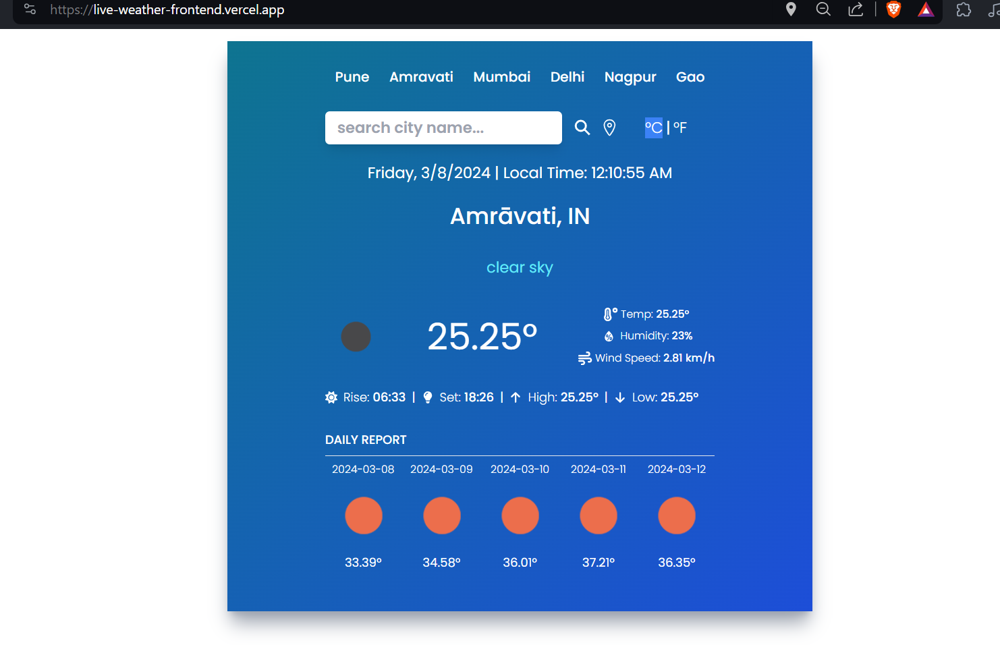

# 🌦️ Live Weather App

Welcome to the Live Weather App! 🎉 This web application provides real-time weather information for cities around the world. It is built using Vite ⚡, React ⚛️, and utilizes the OpenWeatherApp API ☀️.

## Features

- **Real-time Weather Data**: Get up-to-date weather information for any city.
- **Responsive Design**: Enjoy a seamless experience across different devices and screen sizes.
- **Easy-to-Use Interface**: Intuitive user interface for effortless navigation.

## Technologies Used

- [Vite](https://vitejs.dev/): A fast build tool that provides a lightning-fast development experience for web projects.
- [React](https://reactjs.org/): A JavaScript library for building user interfaces.
- [OpenWeatherApp API](https://openweathermap.org/): Provides weather data, including current weather, forecasts, and historical data.

## Getting Started

Follow these steps to run the Live Weather App locally on your machine:

1. **Clone this repository**:

   ```bash
   git clone https://github.com/Aditya-Deshmukh9/Live-weather-frontend.git
   ```

2. **Navigate to the project directory**:

   ```bash
   cd live-weather-app
   ```

3. **Install dependencies**:

   ```bash
   npm install
   ```

4. **Start the development server**:

   ```bash
   npm run dev
   ```

5. **Open your browser** and visit [http://localhost:3000](http://localhost:3000) to view the app.

## Screenshots

Here are some screenshots of the Live Weather App:


_Caption for Screenshot 1_


_Caption for Screenshot 2_

## Contributing

Contributions are welcome! Feel free to submit bug reports, feature requests, or pull requests.

## License

This project is licensed under the MIT License. See the [LICENSE](./LICENSE) file for details.

---
